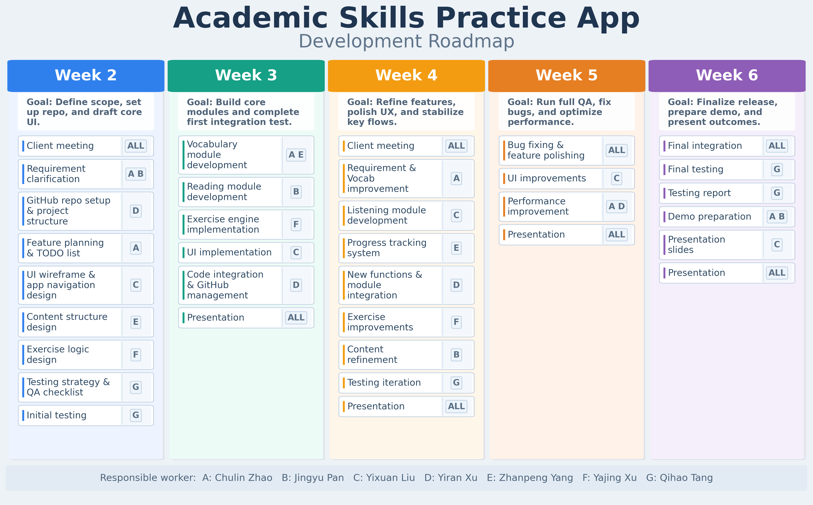

# Overall Planning

1.  Communication with the client (Week 2)  
    *(Understanding project specifications)*
    
2.  Work assignments (Week 2)  
    *(Including interface design, function realization and other necessary parts)*
    
3. Development of the first version

4.  User feedback  
    *(Collection opinions and update requirements)*
    
5. Development of the second version

6. User feedback

7. Development of the final version

8. Presentation

## Visualization

The following image provides a clearer visual version of the planning table above:

## Responsible Key:

A: Chulin Zhao
B: Jingyu Pan
C: Yixuan Liu
D: Yiran Xu
E: Zhanpeng Yang
F: Yajing Xu
G: Qihao Tang
